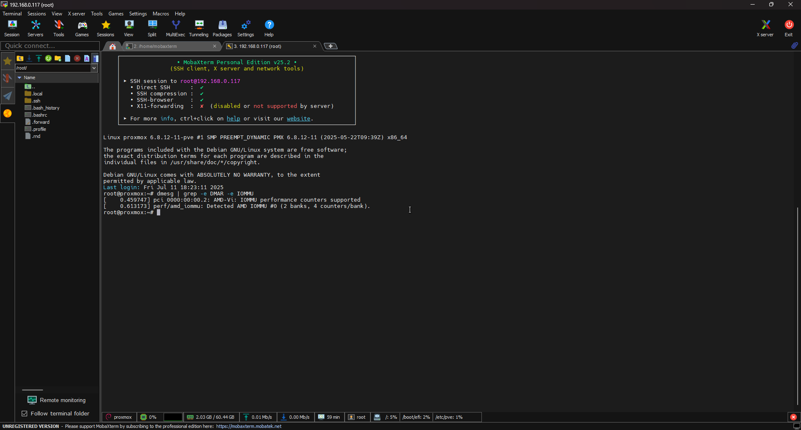
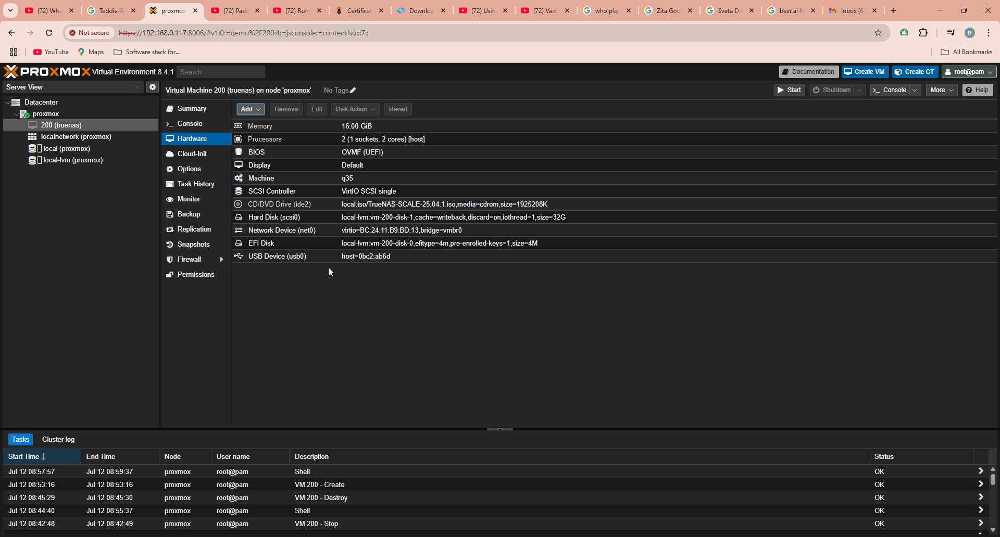
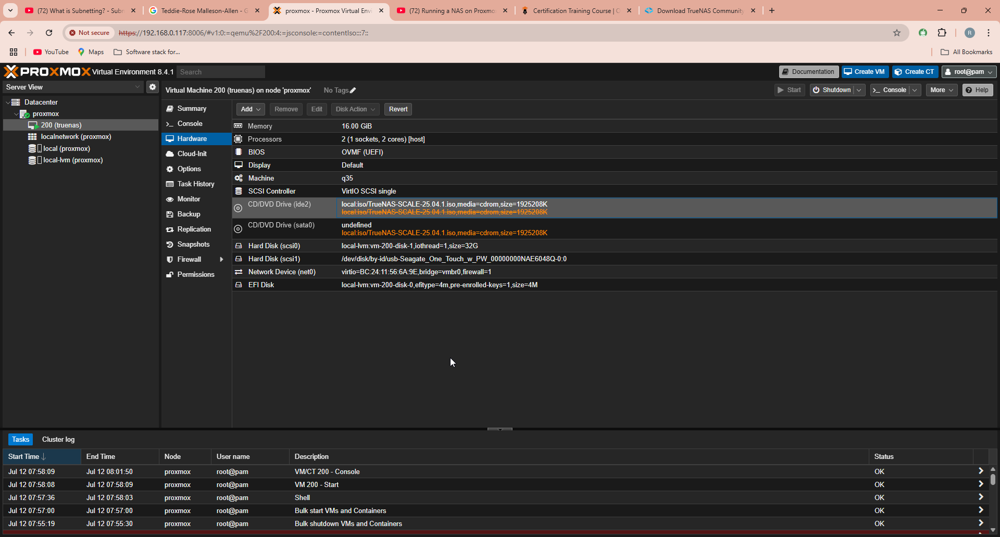
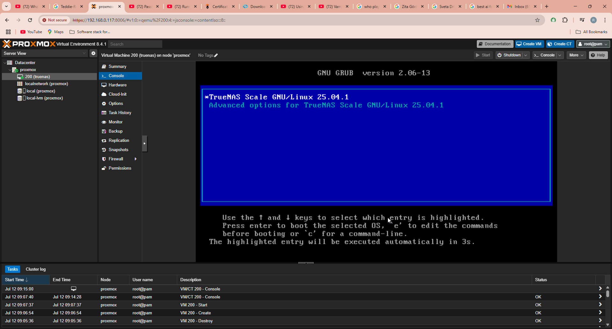
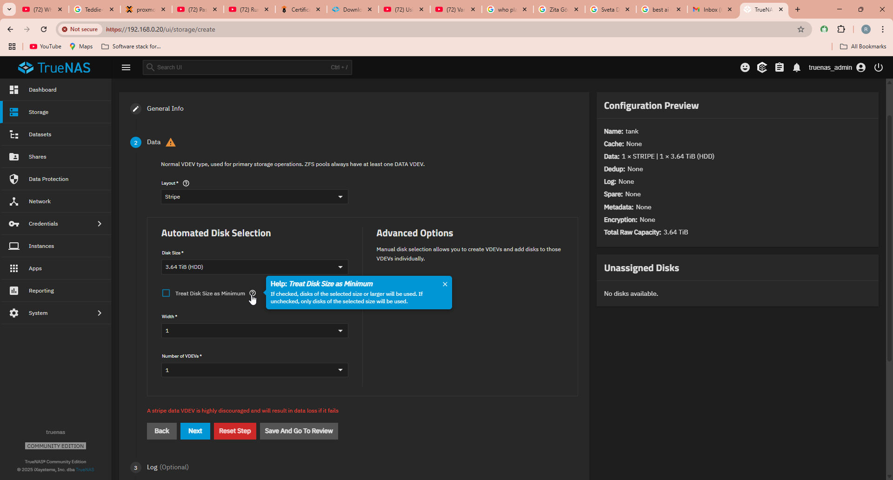
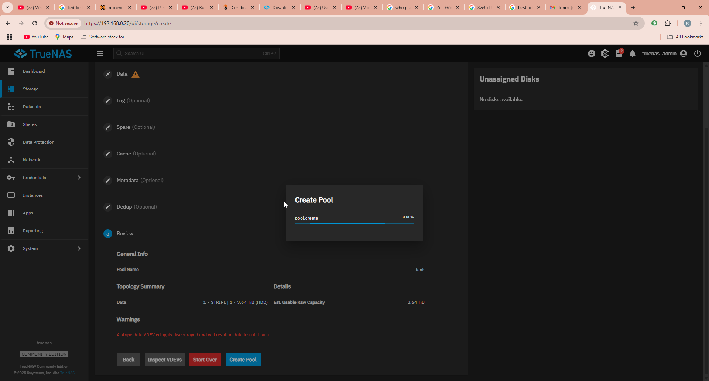
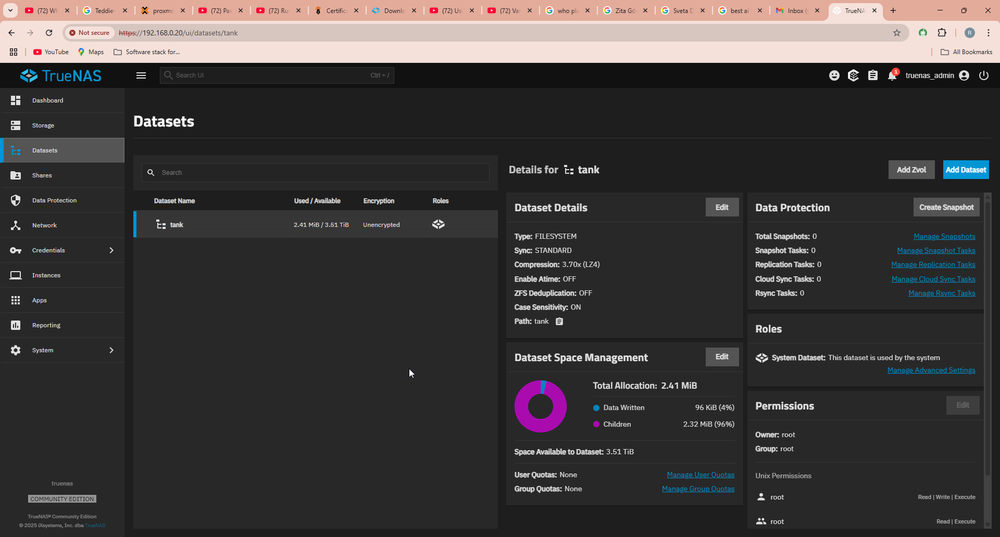
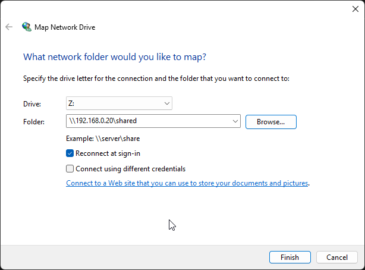

# Project NAS – TrueNAS SCALE Setup & File Sharing

This project documents the process of setting up a reliable and accessible NAS using TrueNAS SCALE inside a Proxmox virtual machine. The goal was to create a basic home lab storage solution with SMB sharing and user-based access, while also learning how to work with ZFS, virtualization, and network configuration in a more hands-on way.

---

## Skills Applied and Learned

- **Virtualization Basics**  
  Setting up and managing a VM in Proxmox, adjusting BIOS settings, and troubleshooting compatibility issues.

- **ZFS Pool Configuration**  
  Creating a storage pool using ZFS with compression and encryption enabled, while learning how datasets and VDEVs are structured.

- **File Sharing Over SMB**  
  Configuring shared folders (datasets) with proper user authentication and mapping them in Windows.

- **User and Permission Management**  
  Creating users inside TrueNAS and assigning appropriate access to datasets.

- **Basic Networking**  
  Assigning static IPs and making sure TrueNAS is reachable within the LAN.

---

## Step-by-Step Setup

### 1. Enable IOMMU and Virtualization
Enabled SVM/VT-d in BIOS and IOMMU support in Proxmox to allow passthrough of storage devices.

### 2. Attach External Drive to the VM
Passed through a USB-connected external HDD to the TrueNAS VM via Proxmox’s hardware configuration tab.

### 3. Fix Boot Compatibility
Initially had trouble booting TrueNAS using the default i440fx and OVMF BIOS. Switching to `q35` and SeaBIOS allowed it to boot properly.

### 4. Install TrueNAS SCALE
Mounted the TrueNAS installer ISO in the VM, selected the right disk, and completed installation without issues.

### 5. Log Into Web UI & Configure Network
Used the console to get the IP address, logged into the TrueNAS web UI, and set a static IP and hostname for consistency within the LAN.

### 6. Create ZFS Pool
Created a single-disk pool with compression and encryption enabled. This was done using a USB drive just to test out the functionality.

### 7. Create Dataset
Inside the pool, created a dataset where shared files would go. This allows for better permission control and future expansion.

### 8. Add a Local User
Created a dedicated user for network file access. This user will authenticate when connecting to SMB shares.

### 9. Set Dataset Permissions
Assigned ownership of the dataset to the new user and adjusted permission flags to allow file read/write access.

### 10. Map the Share in Windows
Mapped the dataset as a network drive in Windows using the NAS IP and share name. Entered the TrueNAS user’s credentials and enabled persistent login.

---

## Troubleshooting: Boot Failure on Default Settings

Originally tried installing with OVMF (UEFI) and the default i440fx machine type, but the VM would freeze or not reach the GRUB installer.

### What Worked:
- **BIOS:** SeaBIOS  
- **Machine Type:** q35

Switching to this combo resolved the boot issues.

---

## Next Steps

This project currently provides reliable local storage and authenticated file sharing over the LAN using TrueNAS SCALE. To expand its functionality and align more closely with best practices in backup and monitoring, the following improvements are planned:

- **Automated Snapshots and Backups**  
  Set up scheduled ZFS snapshots and explore simple backup options like sending data to another drive, VM, or remote host.

- **Monitoring and Alerts**  
  Add basic monitoring using built-in TrueNAS tools or external solutions like Zabbix, to help detect issues like disk failure or high usage.

- **Secure Remote Access**  
  Configure remote access using a VPN such as WireGuard or Tailscale, so files can be accessed safely without exposing SMB ports.

- **Optional Cloud Backup**  
  Experiment with syncing specific datasets (like photos or important documents) to cloud storage using tools like `rclone` or TrueNAS Cloud Sync. This would serve as a basic offsite backup, not a full cloud migration.

- **File Sorting Scripts**  
  Write simple automation scripts (e.g., in Python) to help organize media files on the NAS by year, type, or metadata.

---

## Screenshots

### Pic 1 – IOMMU Check in Proxmox BIOS

### Pic 2 – USB Device Added in VM Hardware

### Pic 3 – Switching IDE to SATA

### Pic 4 – GRUB Boot Screen

### Pic 5 – Disk Setup in TrueNAS

### Pic 6 – Static IP Config in Web UI

### Pic 7 – ZFS Pool Creation

### Pic 8 – Dataset Creation

### Pic 9 – Local User Added

### Pic 10 – Dataset Permissions

### Pic 11 – Windows Network Drive Mapping

